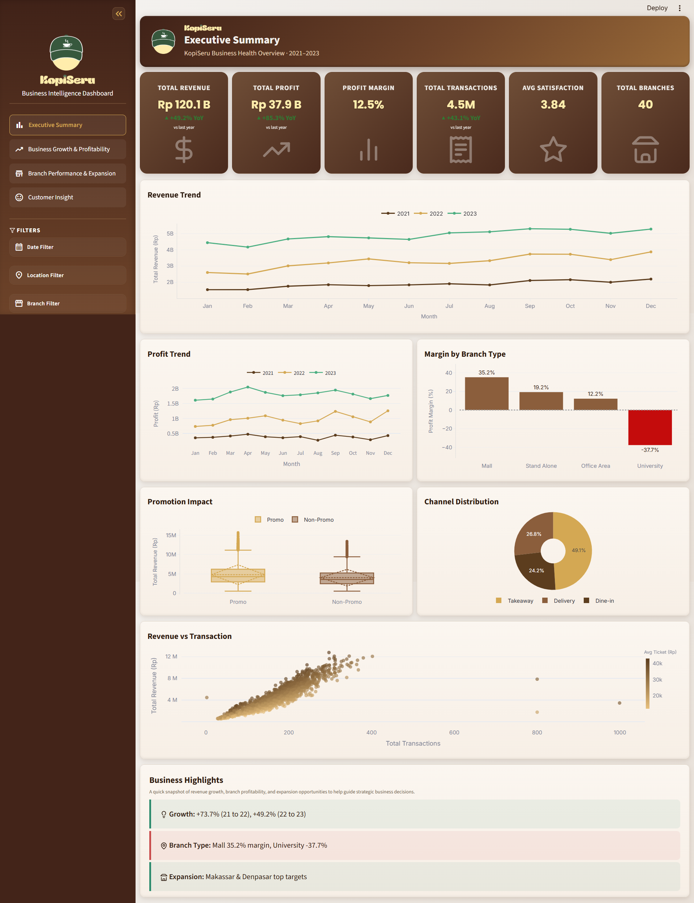
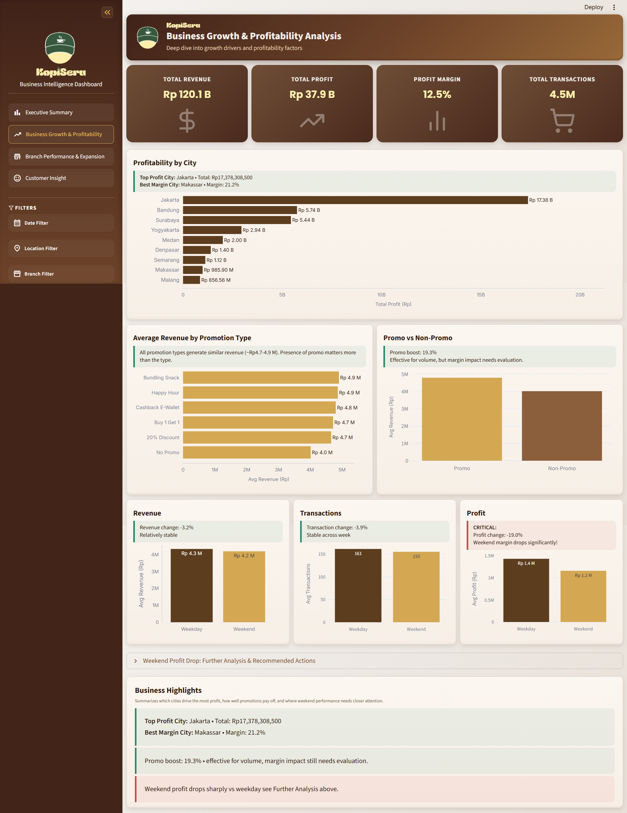
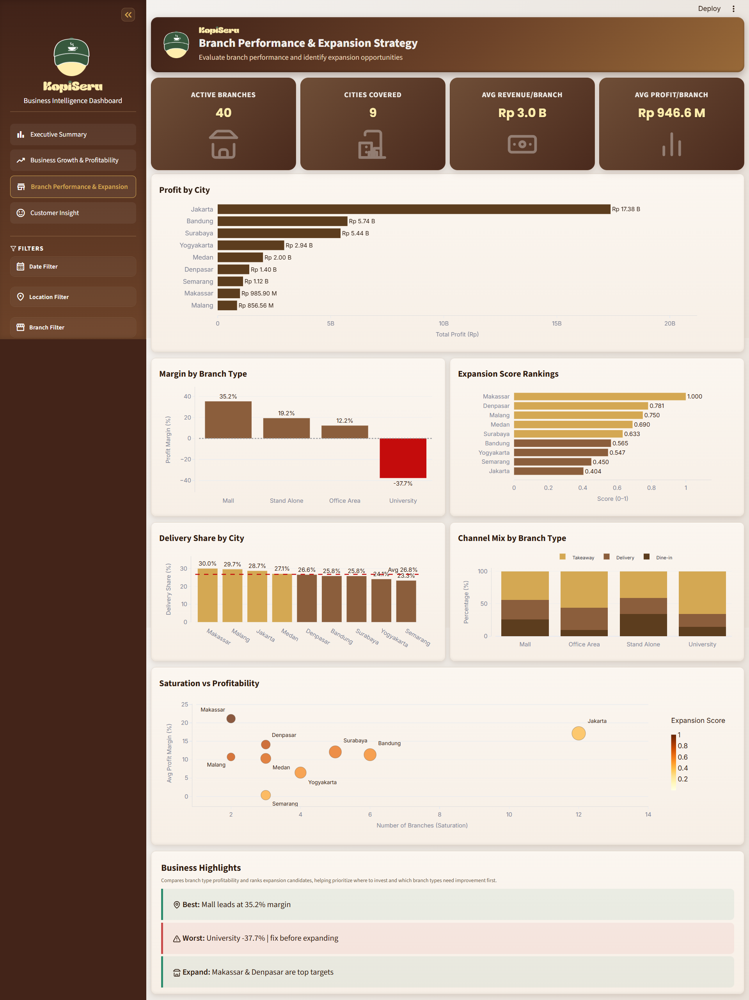
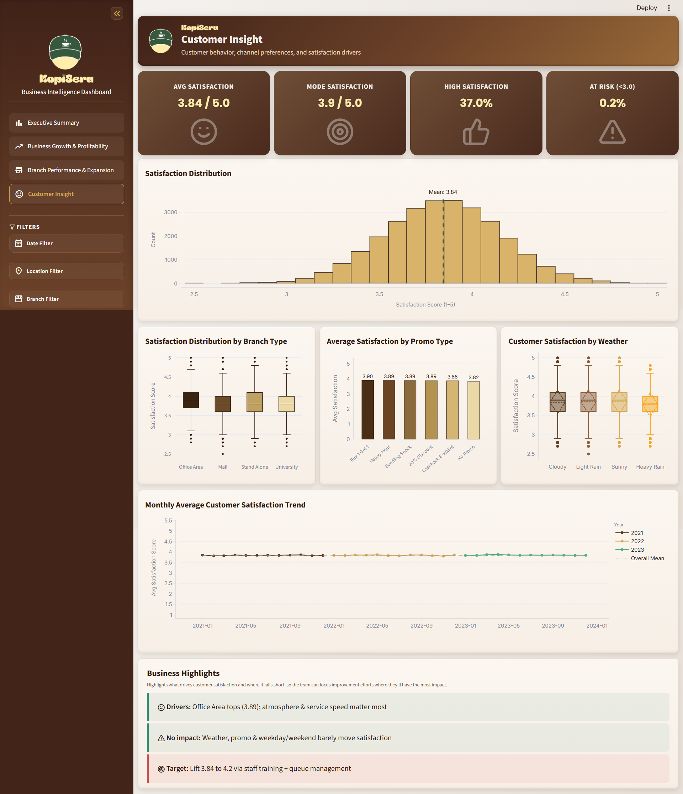

# KopiSeru Business Intelligence Dashboard

> Interactive Business Intelligence dashboard that turns three years of multi-branch coffee retail data into decision-ready insight — built with Streamlit, Pandas, and Plotly.

[](https://www.python.org/)
[](https://streamlit.io/)
[](https://pandas.pydata.org/)
[](https://plotly.com/)
[](#license)
[](#)

---

## Live Demo

**Interactive Dashboard**

*Built and maintained as a Data Analytics portfolio project*, showcasing end-to-end BI dashboard design: data preprocessing, KPI architecture, interactive visualization, and production-grade Streamlit UI engineering.

**Demo URL**

https://kopiseru-dashboard.streamlit.app/

---

## Table of Contents

- [Live Demo](#live-demo)
- [Project Overview](#project-overview)
- [Dataset](#dataset)
- [Business Problem](#business-problem)
- [Objectives](#objectives)
- [Target Users](#target-users)
- [Dashboard Features](#dashboard-features)
- [Feature Highlights](#feature-highlights)
- [Dashboard Pages](#dashboard-pages)
- [Global Filters](#global-filters)
- [Design](#design)
- [Key Metrics](#key-metrics)
- [Dashboard Preview](#dashboard-preview)
- [Dashboard Screenshots](#dashboard-screenshots)
- [Business Value](#business-value)
- [Tech Stack](#tech-stack)
- [Dashboard Architecture](#dashboard-architecture)
- [Project Structure](#project-structure)
- [Installation](#installation)
- [How to Run](#how-to-run)
- [Repository Structure](#repository-structure)
- [Future Improvements](#future-improvements)
- [License](#license)
- [Author](#author)

---

## Project Overview

**KopiSeru Business Intelligence Dashboard** is a multi-page Streamlit application that transforms raw operational data from a coffee retail chain into an interactive analytics workspace for executives and branch managers. It is a **Business Intelligence and KPI monitoring tool** — not a machine learning product. There is no predictive model, training pipeline, or inference layer anywhere in the codebase; every number on screen is a direct or aggregated read of the underlying dataset, computed on demand with Pandas and rendered with Plotly.

The dataset that powers the dashboard (`data/kopiseru_clean_v4.csv`) covers **40 branches across 9 Indonesian cities**, with **27,964 daily operational records spanning January 2021 to December 2023** — including revenue, profit, transaction volume, channel mix (dine-in / delivery / takeaway), promotions, weather conditions, and customer satisfaction scores.

The application is organized as four purpose-built pages, each answering a distinct business question, tied together by a persistent, brand-styled sidebar of global filters.

<details>
<summary><strong>Why this project exists</strong></summary>
<br>

Coffee retail operates on thin margins and high transaction volume, spread across many small locations. Decisions that matter — which branch type to expand, whether a promotion is worth the discount, which city has the most room to grow — are usually buried in spreadsheets that nobody outside the analytics team opens. This dashboard puts those answers in front of the people who actually make the call, with the data updating live as they filter by year, city, branch type, or channel.

</details>

---

## Dataset

The dashboard runs on a single cleaned, analysis-ready CSV: `data/kopiseru_clean_v4.csv`.

| Property | Value |
|---|---|
| Rows | 27,964 |
| Columns | 27 |
| Time span | January 1, 2021 – December 31, 2023 (daily granularity) |
| Branches | 40 |
| Cities | 9 — Jakarta, Surabaya, Bandung, Makassar, Denpasar, Malang, Medan, Yogyakarta, Semarang |
| Branch types | Mall, Office Area, Stand Alone, University |

<details>
<summary><strong>Full column schema</strong></summary>
<br>

| Column | Description |
|---|---|
| `date` | Calendar date of the record |
| `branch_id`, `branch_name` | Branch identifier and display name |
| `branch_city`, `branch_province` | Branch location |
| `branch_type` | Mall / Office Area / Stand Alone / University |
| `open_year` | Year the branch opened |
| `total_transactions` | Number of transactions for the day |
| `total_revenue` | Gross revenue for the day |
| `avg_ticket_size` | Average transaction value |
| `total_cups_sold` | Total cups sold |
| `top_selling_category` | Best-selling product category for the day |
| `dine_in_percent`, `delivery_percent`, `takeaway_percent` | Channel mix as a percentage of sales |
| `employee_on_duty` | Staff count on shift |
| `operating_cost` | Daily operating cost |
| `promo_active` | Whether a promotion was running |
| `promo_type` | Type of promotion active (translated from Indonesian at load time, e.g. `Diskon 20%` → `20% Discount`) |
| `weather` | Weather condition (translated from Indonesian at load time, e.g. `Cerah` → `Sunny`) |
| `is_weekend` | Weekday/weekend flag |
| `customer_satisfaction` | Average customer satisfaction score (1–5 scale) |
| `year`, `month`, `month_name` | Date components used for filtering and aggregation |
| `profit` | Daily profit |
| `profit_margin` | Daily profit margin (%) |

Two additional columns are derived at load time in `utils/data_loader.py` and used throughout the app but not present in the raw CSV: `day_type` (Weekday/Weekend label) and `promo_label` (Promo/Non-Promo label).

</details>

---

## Business Problem

KopiSeru operates 40 branches across 9 cities under four different formats (Mall, Office Area, Stand Alone, University), each with a different cost structure, customer flow, and channel mix. Three years into operation, leadership faces recurring questions that raw transactional data cannot answer on its own:

| Business Question | Why It's Hard Without BI |
|---|---|
| Which branches and cities are actually profitable — not just high-revenue? | Revenue and profit margin move independently; a busy branch can still erode margin. |
| Are promotions increasing revenue enough to justify the discount? | Requires comparing promo vs. non-promo periods, not just raw promo period totals. |
| Where should the next branch open? | Requires balancing profitability against how saturated a market already is. |
| Is customer satisfaction slipping in any segment before it shows up in revenue? | Satisfaction data is granular and needs to be sliced by branch type, promotion, and weather to be actionable. |

Without a consolidated view, these questions require ad-hoc spreadsheet work every time leadership needs an answer — slow, inconsistent, and hard to trust.

---

## Objectives

- Consolidate three years of multi-branch operational data into a single, filterable analytics surface.
- Give executives an at-a-glance read on overall business health (revenue, profit, margin, transactions, satisfaction, footprint).
- Isolate the actual drivers of profitability — city, branch type, promotion, weekday vs. weekend.
- Score and rank cities on expansion potential using a transparent, reproducible formula.
- Surface customer satisfaction trends and risk segments before they erode revenue.
- Keep every page consistent, responsive, and on-brand, with a shared filtering model so a filter set applied on one page mirrors the same slice of data everywhere else.

---

## Target Users

This dashboard is designed primarily for **Business Development Managers (BDM)** and business leaders who are responsible for steering the growth and operational health of the coffee retail chain. Rather than requiring stakeholders to interpret raw transactional data, the dashboard translates operational records into a decision-ready view built around the questions leadership actually asks.

Specifically, the dashboard helps this audience to:

- **Monitor overall business performance** through a consolidated, real-time view of revenue, profit, margin, and transaction trends across the entire branch network.
- **Identify profitable cities and branches** by comparing profitability side by side, rather than relying on revenue alone as a proxy for performance.
- **Evaluate promotional effectiveness** by directly comparing promo and non-promo periods and isolating which promotion types generate the strongest return.
- **Support branch expansion decisions** using the Expansion Score framework, which ranks cities by a transparent combination of profitability and market saturation.
- **Monitor customer satisfaction** across branch types, promotions, and weather conditions to catch experience issues before they show up as lost revenue.
- **Make faster, data-driven decisions** by replacing ad-hoc spreadsheet analysis with a single, filterable, always-consistent source of truth.

---

## Dashboard Features

- **Four dedicated analysis pages** — Executive Summary, Business Growth & Profitability, Branch Performance & Expansion, Customer Insight — each with its own KPI row, chart set, and narrative "Business Highlights" panel.
- **Eight global sidebar filters** — Year, Month, City, Branch Type, Promotion, Sales Channel, Weather, and Day Type — applied consistently across all four pages via a single `apply_filters()` function, with a one-click **Reset All Filters** control.
- **Custom KPI cards** with icon watermarks, trend deltas, and captions, rendered through a shared `metric_card()` component so every page keeps a consistent visual language.
- **Fully interactive Plotly charts** — line trends, grouped and stacked bars, box plots, scatter plots, bubble charts, histograms, and a correlation heatmap — all themed to the KopiSeru color palette.
- **Composite Expansion Score** for city-level growth prioritization, computed from normalized profit margin and market saturation.
- **Bilingual data normalization** — the loader translates Indonesian source labels (e.g. `Cerah` → `Sunny`, `Diskon 20%` → `20% Discount`) into English at load time without mutating the source CSV.
- **Custom branded UI** — a hand-built sidebar navigation (Streamlit's default page nav is hidden via `position="hidden"`), a gradient hero header on every page, and an extensive CSS layer (`assets/main.css` plus page-level style injection) for pixel-level control over card heights, chart containers, and spacing.
- **Cached, single-pass data loading** — the dataset is read and preprocessed once via `st.cache_data`, with all aggregation logic centralized in `utils/data_loader.py`.

---

## Feature Highlights

| Metric | Detail |
|---|---|
| Branches | 40 |
| Cities | 9 |
| Records | 27,964 |
| Dashboard Pages | 4 Interactive Pages |
| Global Filters | 8 |
| Charts | 20+ Interactive Charts |
| KPI Components | Custom-Built |
| Expansion Analysis | Expansion Score Framework |
| Interface | Responsive Streamlit UI |
| Visualization Engine | Plotly Interactive Visualizations |

These figures reflect the actual scale and scope of the underlying dataset and application — not illustrative placeholders — and are computed directly from `data/kopiseru_clean_v4.csv` and the dashboard's own component architecture.

---

## Dashboard Pages

### 1. Executive Summary
**Purpose:** Give leadership a single-glance read on overall business health.

| Component | Detail |
|---|---|
| KPI Row | Total Revenue, Total Profit, Profit Margin, Total Transactions, Avg. Satisfaction, Total Branches |
| Revenue Trend | Monthly revenue trend across the full 2021–2023 window |
| Profit Trend | Monthly profit trend, paired alongside revenue |
| Margin by Branch Type | Profit margin compared across Mall, Office Area, Stand Alone, and University formats |
| Promotion Impact | Revenue impact of active promotions vs. no-promotion periods |
| Channel Distribution | Split between Dine-in, Delivery, and Takeaway |
| Revenue vs. Transaction Scatter | Relationship between transaction volume and revenue per branch-day |
| Business Highlights | Narrative callouts on YoY growth, branch-type margin spread, and top expansion targets |

### 2. Business Growth & Profitability Analysis
**Purpose:** Isolate what actually drives profitability.

| Component | Detail |
|---|---|
| KPI Row | Total Revenue, Total Profit, Profit Margin, Total Transactions |
| Profitability by City | City-level profit comparison |
| Average Revenue by Promotion Type | Revenue broken down by each specific promotion type |
| Promo vs. Non-Promo | Direct before/after comparison of promotional impact |
| Weekday vs. Weekend | Revenue, transaction, and profit comparison across day types |
| Business Highlights | Narrative insight boxes on the strongest profitability drivers |

### 3. Branch Performance & Expansion Strategy
**Purpose:** Support data-driven branch expansion decisions.

| Component | Detail |
|---|---|
| KPI Row | Active Branches, Cities Covered, Avg. Revenue / Branch, Avg. Profit / Branch |
| Profit by City | Total profit contribution by city |
| Margin by Branch Type | Profitability comparison across branch formats |
| Expansion Score Rankings | Composite score combining normalized profit margin and market saturation |
| Delivery Share by City | Delivery channel penetration across cities |
| Channel Mix by Branch Type | Dine-in / Delivery / Takeaway mix per branch format |
| Saturation vs. Profitability | Bubble chart plotting branch density against profitability by city |
| Business Highlights | Narrative recommendations on where to expand next |

### 4. Customer Insight
**Purpose:** Track and diagnose customer satisfaction.

| Component | Detail |
|---|---|
| KPI Row | Average Satisfaction, Mode Satisfaction, % High Satisfaction, % At-Risk (<3.0) |
| Satisfaction Distribution | Histogram of satisfaction scores across all records |
| Satisfaction by Branch Type | Distribution compared across the four branch formats |
| Satisfaction by Promotion | Average satisfaction under each promotion type |
| Satisfaction by Weather | Average satisfaction across weather conditions |
| Monthly Satisfaction Trend | Trailing satisfaction trend over the full three-year period |
| Business Highlights | Narrative insight boxes flagging risk segments and satisfaction drivers |

---

## Global Filters

Every page shares the same filtering layer, rendered by `components/sidebar.py` and applied by `apply_filters()` in `utils/data_loader.py`. Filters are grouped into collapsible sections in the sidebar, and a single **Reset All Filters** button clears every selection back to its full default range.

| Filter Group | Filter | Options Source |
|---|---|---|
| Date Filter | Year | Distinct `year` values in the dataset |
| Date Filter | Month | Distinct `month` values, displayed as month names |
| Location Filter | City | Distinct `branch_city` values |
| Branch Filter | Branch Type | Mall, Office Area, Stand Alone, University |
| Promotion Filter | Promotion | Distinct `promo_type` values |
| Sales Channel | Channel | Takeaway, Delivery, Dine-in |
| Operational Condition | Weather | Distinct `weather` values |
| Operational Condition | Day Type | Weekday, Weekend |

Because filtering logic lives in one shared function rather than being duplicated per page, the same filter selection always produces identical, reconcilable numbers whether you're looking at the Executive Summary or the Customer Insight page.

---

## Design

The dashboard uses a fully custom visual identity rather than Streamlit's default theme:

| Element | Detail |
|---|---|
| Color palette | Coffee Brown (`#5C3D1E`), Warm Gold (`#D4A853`), Cream (`#FDF6EC`), plus supporting tones for success/warning/danger states |
| Navigation | Custom sidebar navigation built in `main.py` — Streamlit's default page nav is hidden (`st.navigation(pages, position="hidden")`) so link order, icons, and active-state styling can be fully controlled |
| Branding | KopiSeru logo and wordmark rendered as inline base64 images in the sidebar header and on every page's hero header |
| KPI cards | Custom `.kpi-card` components with icon watermarks, colored deltas, and captions — consistent across all four pages |
| Charts | All Plotly figures share a common base layout and color palette defined in `components/charts.py`, so every chart looks like part of the same product |
| Layout | Wide layout, responsive column-based grids, with extensive CSS (`assets/main.css` + inline style injection) to keep chart cards and KPI panels aligned to equal heights |

---

## Key Metrics

The dashboard's KPI layer is powered by `build_summary_stats()` in `utils/data_loader.py`, which computes headline figures once per filtered dataframe:

| Metric | Source Column(s) | Aggregation |
|---|---|---|
| Total Revenue | `total_revenue` | Sum |
| Total Profit | `profit` | Sum |
| Profit Margin | `profit_margin` | Mean |
| Total Transactions | `total_transactions` | Sum |
| Avg. Ticket Size | `avg_ticket_size` | Mean |
| Avg. Customer Satisfaction | `customer_satisfaction` | Mean |
| Active Branches | `branch_id` | Distinct count |
| Cities Covered | `branch_city` | Distinct count |

**Expansion Score** (`expansion_score()`) is a custom composite metric built specifically for this dashboard: profit margin and inverse branch saturation are each normalized to a 0–1 range per city, then averaged with equal weighting to produce a single, sortable ranking of expansion potential.

---

## Dashboard Screenshots

| Executive Summary | Business Growth & Profitability |
|---|---|
|  |  |

| Branch Performance & Expansion | Customer Insight |
|---|---|
|  |  |

---

## Business Value

- **Faster decisions.** What used to require pulling a spreadsheet and manually filtering is now a live, shareable view — leadership gets an answer in the time it takes to click a filter.
- **Profitability over vanity metrics.** By pairing revenue with margin and profit at every level (city, branch type, promotion), the dashboard prevents high-revenue-but-low-margin branches from being mistaken for strong performers.
- **Objective expansion criteria.** The Expansion Score replaces gut-feel branch-opening decisions with a reproducible, data-backed ranking that any stakeholder can audit.
- **Early warning on customer experience.** Segmenting satisfaction by branch type, promotion, and weather surfaces at-risk segments before they show up as revenue decline.
- **One source of truth.** Because every page shares the same filtering and aggregation layer (`utils/data_loader.py`), numbers stay consistent across Executive Summary, Growth Analysis, Expansion Strategy, and Customer Insight — no more reconciling conflicting spreadsheets.

---

## Tech Stack

| Layer | Technology |
|---|---|
| Application framework | [Streamlit](https://streamlit.io/) (multi-page app via `st.navigation`) |
| Data processing | [Pandas](https://pandas.pydata.org/) |
| Numerical operations | [NumPy](https://numpy.org/) |
| Visualization | [Plotly](https://plotly.com/python/) (`plotly.graph_objects`) |
| Styling | Custom CSS (`assets/main.css`) + component-level style injection |
| Language | Python 3.10+ |

---

## Dashboard Architecture

The application follows a linear, single-direction data flow: raw data is loaded once, cleaned, filtered by the user, aggregated into business metrics, and rendered through reusable visual components on each page.

```
Raw CSV Dataset
        │
        ▼
Data Loader
        │
        ▼
Preprocessing
        │
        ▼
Global Filters
        │
        ▼
Business Aggregations
        │
        ▼
Reusable Plotly Components
        │
        ▼
Dashboard Pages
        │
        ▼
Business Insights
```

- **Raw CSV Dataset** — `data/kopiseru_clean_v4.csv`, the single source of truth for the entire application.
- **Data Loader** — `utils/data_loader.py` reads the CSV once and caches it via `st.cache_data` so it is never re-read on every interaction.
- **Preprocessing** — dtype casting, Indonesian-to-English label translation, and derived columns (`day_type`, `promo_label`, `year_month`) are applied at load time.
- **Global Filters** — `components/sidebar.py` collects the user's selections; `apply_filters()` applies them consistently to produce a single filtered dataframe.
- **Business Aggregations** — dedicated functions in `utils/data_loader.py` (`monthly_revenue`, `city_performance`, `expansion_score`, `satisfaction_by_factor`, and others) turn the filtered dataframe into page-ready metrics.
- **Reusable Plotly Components** — `components/charts.py` and `components/cards.py` convert aggregated data into themed charts and KPI cards shared across all pages.
- **Dashboard Pages** — the four pages in `pages/` assemble these components into a complete, page-specific narrative.
- **Business Insights** — the final output: KPI cards, charts, and narrative "Business Highlights" panels that translate raw operational data into decisions leadership can act on.

This layered structure keeps every page consistent and every number reconcilable, since all filtering and aggregation logic passes through the same shared functions rather than being duplicated per page.

---

## Project Structure

```
.
├── assets
│   ├── Icon_topi.png
│   ├── LogoKopiSeru.png
│   └── main.css
├── components
│   ├── __init__.py
│   ├── cards.py
│   ├── charts.py
│   └── sidebar.py
├── data
│   └── kopiseru_clean_v4.csv
├── pages
│   ├── 1_Executive_Summary.py
│   ├── 2_Business_Growth_&_Profitability.py
│   ├── 3_Branch_Performance_&_Expansion.py
│   └── 4_Customer_Insight.py
├── utils
│   ├── __init__.py
│   ├── data_loader.py
│   └── icons.py
├── main.py
├── README.MD
├── LICENSE
└── requirements.txt
```

<details>
<summary><strong>What each module is responsible for</strong></summary>
<br>

| Module | Responsibility |
|---|---|
| `main.py` | Application entry point — page config, CSS injection, brand sidebar header, and custom page navigation (`st.navigation` with hidden default nav so the sidebar order and styling can be fully controlled). |
| `components/sidebar.py` | Renders the eight global filters (Year, Month, City, Branch Type, Promotion, Channel, Weather, Day Type) and the Reset All Filters control; returns a filters dict consumed by every page. |
| `components/cards.py` | Reusable UI primitives — `metric_card()`, `section_header()`, `info_box()`, currency/number formatters, and the compact-layout CSS shared across all pages. |
| `components/charts.py` | All Plotly figure builders — trend lines, bar comparisons, scatter/bubble plots, box plots, histograms, and the correlation heatmap — each themed to the KopiSeru palette. |
| `utils/data_loader.py` | Single source of truth for data access: CSV loading, caching, preprocessing (dtype casting, Indonesian-to-English label translation, derived columns), the `apply_filters()` engine, and every aggregation helper (`monthly_revenue`, `city_performance`, `expansion_score`, etc.). |
| `utils/icons.py` | Inline Lucide-style SVG icon library used across KPI cards and sidebar labels — no external icon dependency. |
| `data/kopiseru_clean_v4.csv` | The cleaned, analysis-ready dataset: 27,964 rows × 27 columns, 40 branches, 9 cities, Jan 2021–Dec 2023. |

</details>

---

## Installation

**Prerequisites:** Python 3.10 or later, `pip`.

1. Clone the repository:

   ```bash
   git clone https://github.com/indrianisaptr/KopiSeru-Business-Growth-Intelligence-Dashboard.git
   cd kopiseru-bi-dashboard
   ```

2. (Recommended) Create and activate a virtual environment:

   ```bash
   python -m venv venv
   source venv/bin/activate      # Windows: venv\Scripts\activate
   ```

3. Install dependencies:

   ```bash
   pip install -r requirements.txt
   ```

   <details>
   <summary>requirements.txt</summary>

   ```
   streamlit>=1.32.0
   pandas>=2.0.0
   plotly>=5.18.0
   numpy>=1.24.0
   ```

   </details>

---

## How to Run

From the project root:

```bash
streamlit run main.py
```

Streamlit will start a local server (default: `http://localhost:8501`) and open the **Executive Summary** page by default. Use the sidebar to switch between the four pages and to apply global filters — every filter you set is applied consistently across all pages via the shared `apply_filters()` engine.

---

## Repository Structure

| Path | Type | Tracked |
|---|---|---|
| `.streamlit/config.toml` | Streamlit theme & server configuration | ✅ |
| `assets/` | Brand logos and shared stylesheet | ✅ |
| `components/` | UI and chart components | ✅ |
| `data/kopiseru_clean_v4.csv` | Source dataset | ✅ |
| `pages/` | Individual dashboard pages | ✅ |
| `utils/` | Data loading, aggregation, and icon utilities | ✅ |
| `__pycache__/`, `.streamlit/secrets.toml`, `venv/` | Build artifacts / local environment | ❌ (see `.gitignore`) |

---

## Future Improvements

- **Data pipeline automation** — replace the static CSV with a scheduled ETL job (e.g. Airflow or a lightweight cron script) pulling from a live POS or ERP source.
- **Forecasting layer** — introduce a genuinely separate ML module (outside the scope of this BI project) for revenue and demand forecasting, kept decoupled from the core BI pages.
- **Role-based views** — tailor visible pages and filters by user role (e.g. regional manager vs. C-level).
- **Export & reporting** — add PDF/PPTX export of each page's Business Highlights for offline board reporting.
- **Automated alerts** — threshold-based notifications when a branch's margin or satisfaction score drops below a defined baseline.
- **Deployment** — containerize with Docker and add CI for automated linting/testing on push.

---

## License

This project is licensed under the [MIT License](LICENSE).

---

## Author

**Built and maintained as a Data Analytics Engineering portfolio project**, showcasing end-to-end BI dashboard design: data preprocessing, KPI architecture, interactive visualization, and production-grade Streamlit UI engineering.

Feel free to open an issue or submit a pull request if you'd like to contribute or suggest improvements.
